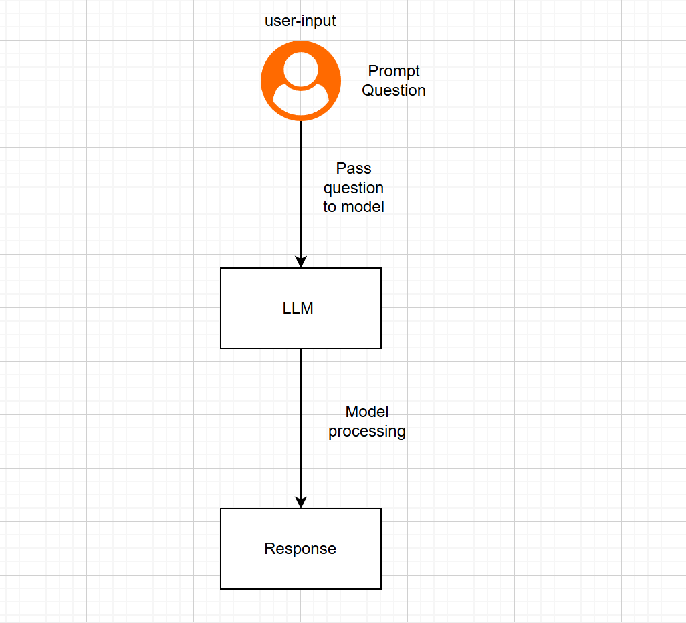

# GenAi-practise
This repo is used to practise genai concepts

RAG:

RAG (Retrieval-Augmented Generation) improves LLM responses by retrieving the most relevant information from a vector database before generating an answer.
The user query is converted into embeddings, matched with similar documents, and the retrieved context is sent to the LLM to produce an accurate response.

Langchain Flow

LangChain simplifies building LLM applications by connecting prompts, models, parsers, and other components into a single workflow.

